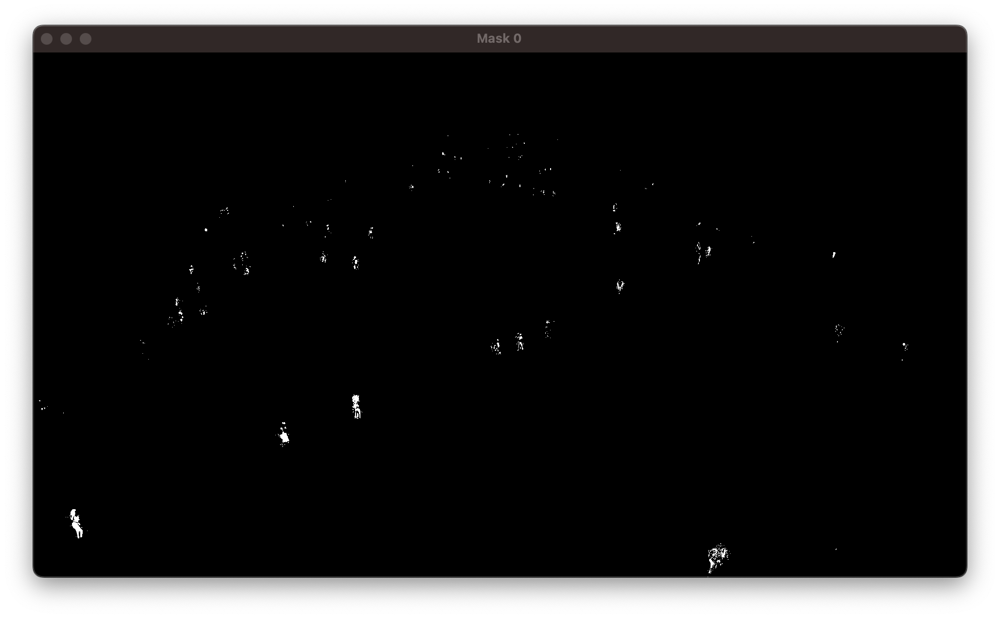
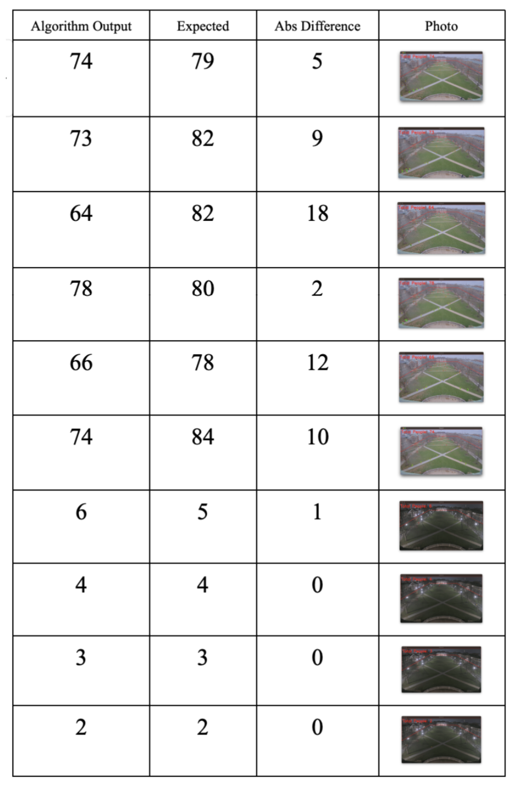
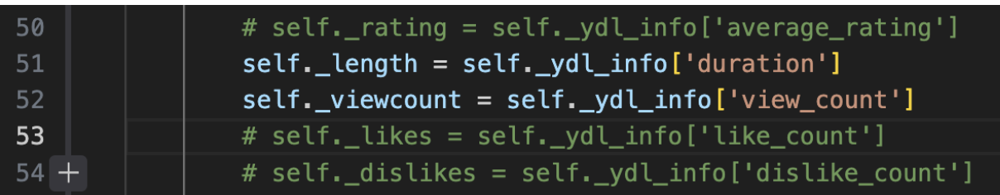

# CS445 Final Project - Quad Counter 
Matthew Paul (mjpaul3) and Vincent Nguyen (vbn3)

Our final project estimates the number of people on the UIUC Quad by utilizing the UIUC Quad cam live stream, and implementing object detection and object tracking techniques. We originally wanted to count people going into a local restaurant, but we pivoted since there currently isn’t much traffic in that area and we couldn’t find a reliable place to position a camera. In theory, this code should also work for our original proposal and similar situations with a few tweaks to detection settings and boundaries. A video of our project can be found in our github repo.

https://github.com/vincentbanguyen/UIUC-CAM-CV/assets/72878425/6b5c4201-2dd6-4035-8675-3f9888f8d753

## Motivation and impact: 
The motivation behind this project is to provide insight into how crowded the Quad is in real-time. The hope is that people can use this tool to help them decide if they want to relax on the Quad uninterrupted on a quiet evening, or if they are in the mood to socialize when the Quad is lively. We also found the idea of using a live stream instead of a pre-recorded video extremely interesting, and what we learned during this project opened the doors to more exciting and innovative ideas.

## Approach: 
Counting people on a live stream camera could be approached in a number of different ways. After some online research, we decided to pursue the method of object detection and object tracking. The main idea for this method is to first identify the entities of interest and their coordinates on the image. The next step is to compare two frames to track the movement and isolate each person’s contour. We then want to assign a unique identifier to each person and make sure it remains constant across multiple frames. In doing so, we can count the number of people on a given frame by counting the unique objects.
 
There are popular open source tools such as YOLO for object detection and SORT for object tracking, but we decided to try and implement a simpler version ourselves from scratch since we’d learn much more. We also fine-tuned some parameters in our object detection and tracking algorithms to reduce estimation error as much as we could.

## Results:


Annotated Frame


Mask

Our main output is the livestream with an overlay of contours and registered detections as well as a total counter. There is also a red border to indicate our region of interest. Additionally, we have access to the mask generated from our object detection to use for debugging and tuning parameters.

Comparing our algorithm to manually counting, among 10 trials our algorithm generally had an error of around 10 detections. It can be observed that it performed worse during the busy daytime and better at night with fewer people on the Quad.

Since the goal of the project was to have a gauge on how crowded the Quad is, our error is sufficiently low enough.

## Table of Output vs. Expected


## Implementation details:
Language: Python
Packages: OpenCV, Numpy, pafy, youtube-dl
Online references that taught us the concept of object detection and object tracking, and referenced minimal code from them:
https://www.youtube.com/watch?v=O3b8lVF93jU,
https://pyimagesearch.com/2018/08/13/opencv-people-counter/

## Implementation: 
We implemented an existing technique by following the concept of object detection and object tracking. However, we were able to create our own version of object detection and tracking mostly from scratch and not using popular existing models. Fortunately, we were able to get our desired results with reasonably low error since we had just wanted to gauge how crowded the Quad was and didn’t need an exact number.

### Object Detection Implementation:
Our object detection was mainly supported by a function from the OpenCV called cv2.createBackgroundSubtractorMOG2(history=100, varThreshold=50). The basic idea of our object detection was to isolate moving entities, which in our case would be humans walking on the Quad by subtracting the static background of the video using a Gaussian Mixture model. It is important to note that we had parameters we were able to tweak in the function. History represents the number of frames to build the background model, and a higher value is better for slower moving objects. varThreshold represents a threshold that determines if a pixel should be considered part of the moving entity or the static background, so a lower value means less sensitivity to pixel intensity changes. 

After we isolated the people, we created a mask and utilized cv2 to draw contours (green) and calculated the area to determine if the identified moving object was big enough to be a human instead of a moving branch in the wind or squirrel. We recorded the sufficiently large contours and classified the coordinates as “detections” for the detected objects

### Object Tracking Implementation:
The big idea of our object tracking is to compare detected objects and their movement distance frame by frame. From one frame to the next, if a detected object has moved below the movement threshold we set, we know it’s still the same person and don’t have to overcount them. Additionally, if there are new detections that are not sufficiently near any previously registered objects, it is added as a new object with a unique identifier. 

The other parameter used is a set object life. Since there is a chance for an object not to be detected in a given frame, we give each previously detected object a lifespan; if it is not registered to a detection on the current frame, its lives decrease. We only say an object is lost when its lives hit zero since the counter can reset if it locks back onto a detection. Doing so makes sure we have a more accurate count of people since sometimes they can occasionally be obstructed from the camera.

## Challenge / innovation:
We expect to get full points on our challenge/innovation component since we implemented some new innovative techniques to improve our results. 

### Multiple detected objects on one person:
We had an issue where one person would be counted over 3 times due to an inconsistent mask around the person since it seemed to split the person into their upper torso, lower torso, and their shoes. To solve this problem, we thought to apply a Gaussian blur onto the frame such that we would have a more consistent mask, and our contour would observe a single entity instead of 3 smaller entities, and this seemed to alleviate the problem of overcounting.

### Angled camera perspective:
In order for a person to be counted as a detection, they have to be above a certain size requirement since we had to account for moving branches with small contour areas. However, this size requirement introduced an issue with an angled camera perspective where people appear differently sized depending on their vertical position in the frame. To combat this, we implemented a non-linear scalar factor to the size requirement such that people higher up in the frame would have a smaller size requirement relative to people at the bottom of the frame.

### Deregistering temporarily hidden people:
We had an issue where people shortly hidden under the branches of a tree would not be counted since it would appear as if they had surpassed movement threshold from frame to frame. We came up with an idea to add frame lifespan to each detected people, and if they were hidden from a frame, their life span would decrease, and we would not count them anymore if the count hit 0. 

### Stationary people:
A challenge we continue to have is our detection software not picking up stationary people. This is due to the way we implemented our detection; the mask is based off of movement from the previous frame so anything stationary is not visible in the mask. To combat this, we tried creating an additional mask by taking a snapshot of the background to compare with the current frame’s mask and bitwise OR the two, but this ended up creating phantom detections due to the initial background still having people in the image. In the end we did not use this idea, but a similar method will eventually be needed to deal with non-moving  objects. Even though our current implementation has this limitation, it still does a great job of giving us an estimate of the number of people.

## How to Run

To run the project, follow these steps:

1. Install the required Python packages using the following commands:

    ```bash
    pip3 install opencv-python
    pip3 install pafy
    pip3 install youtube-dl
    ```

2. Fix the issue related to youtube-dl live stream processing by running the following command:

    ```bash
    pip3 install --upgrade --force-reinstall "git+https://github.com/ytdl-org/youtube-dl.git"
    ```

3. Fix an error wiht the library pafy by opening  the file located at at the library path for pafy and edit the file 'pafy/backend_youtube_dl.py`.

4. Comment out lines 50, 53, and 54.
   

