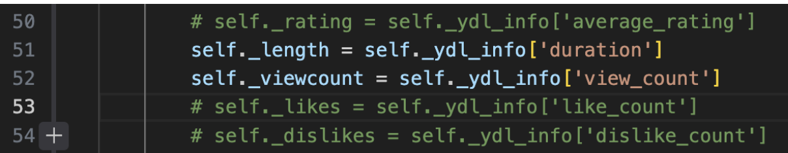

# QuadCounter
Our final project estimates the number of people on the quad by utilizing the UIUC live stream and object detection and object tracking. We originally wanted to count people going into a local restaurant, but we pivoted since there currently isn’t much traffic in that area and we couldn’t find a reliable place to position a camera. In theory, this code should also work for our original proposal and similar situations with a few tweaks to detection settings and boundaries.


## How to Run

To run the project, follow these steps:

1. Install the required Python packages using the following commands:

    ```bash
    pip3 install opencv-python
    pip3 install pafy
    pip3 install youtube-dl
    ```

2. Fix the issue related to youtube-dl live stream processing by running the following command:

    ```bash
    pip3 install --upgrade --force-reinstall "git+https://github.com/ytdl-org/youtube-dl.git"
    ```

3. Fix an error wiht the library pafy by opening  the file located at at the library path for pafy and edit the file 'pafy/backend_youtube_dl.py`.

4. Comment out lines 50, 53, and 54.
   

